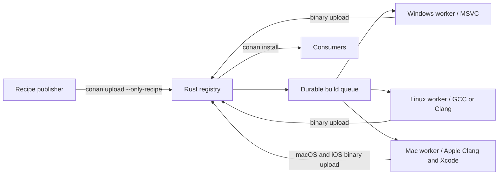

# conan-server

A small Conan 2 package registry and automatic build service written in Rust.
Upload a recipe with the standard Conan CLI; native workers build its binaries
for Windows, Linux, macOS, and iOS and publish them back to the registry.

**Status: working prototype.** This is an independent project, not JFrog
Artifactory or the Python `conan_server` reference implementation. It implements
a tested subset of the Conan 2 remote protocol, not the Artifactory API.



## What works

- Conan 2 recipe and binary uploads, downloads, search, revision listing, and
  latest-revision lookup. User/channel references and references without them.
- Streaming file transfers, SHA-256 addressed blobs, SQLite metadata and job queue.
- Recipes become visible and enqueue jobs only when the manifest and required
  artifacts have arrived. Re-uploading a revision does not duplicate jobs.
- Immutable revision files; conflicting writes return HTTP 409.
- Separate publisher and worker tokens; public, anonymous package downloads.
- Native workers poll outbound, so build machines need no inbound ports.
- Explicit target matrix, worker leases, heartbeats, expired-lease recovery,
  failed-job retry, bounded job duration, and per-job Conan caches.
- macOS and iOS profiles, including device and simulator variants.

The server never imports or executes `conanfile.py`. Workers use the real
Python Conan client to resolve dependencies and build packages. Python, Conan,
and compilers are only needed on workers and developer build machines.

## Build

```sh
cargo build --release --locked
```

The server uses SQLite and a local data directory; it needs no external database.
Keep `registry.sqlite3` and `blobs/` together. Stop the server before copying the
whole data directory for a consistent backup. One server process per data directory.

## Start the server

Generate two different random tokens (each at least 32 characters) and place them
in the environment. Keep the publisher token on machines allowed to submit code;
keep the worker token on trusted build machines.

```sh
export CONAN_SERVER_PUBLISH_TOKEN="$(openssl rand -hex 32)"
export CONAN_SERVER_WORKER_TOKEN="$(openssl rand -hex 32)"

./target/release/conan-server serve \
  --listen 127.0.0.1:9300 \
  --data ./data \
  --targets examples/targets.json
```

Persist these tokens in your service's secret configuration when deploying.
The default listener is loopback. For remote workers, bind a suitable private
interface and expose the service through an HTTPS reverse proxy. The default
artifact upload limit is 2 GiB; use `--max-upload-mib` to change it.

Omit `--targets` for a registry with automatic builds disabled. The example
matrix contains seven Release targets; remove targets you don't have workers
for. Each target has a stable ID, runner OS, host OS, architecture, and build type.
iOS targets additionally specify the SDK and minimum OS version.

## Upload a recipe

```sh
conan remote add forge http://127.0.0.1:9300
conan remote login forge publisher
# Enter CONAN_SERVER_PUBLISH_TOKEN at the password prompt.

conan export path/to/recipe --name hello --version 1.0
conan upload 'hello/1.0' -r forge --only-recipe --confirm --check
```

For CI, set `CONAN_LOGIN_USERNAME_FORGE=publisher` and
`CONAN_PASSWORD_FORGE` to the publisher token instead of interactive login.

Recipes need to export their build inputs or fetch publicly accessible sources.
Use fixed source versions/checksums and pinned Conan dependencies for repeatable
builds. A recipe alone cannot select every compiler, ABI, and SDK: the server
matrix and worker profiles define the supported binary configurations.

## Start workers

Install Conan **2.27.1**, CMake, and the relevant compiler on each build machine.
Use `pip install conan==2.27.1`. Rust is needed to compile this service, not to run
the resulting executable. Supply the worker token through
`CONAN_SERVER_WORKER_TOKEN`.

Linux:

```sh
conan-server worker --server https://packages.example.org \
  --id linux-1 --target linux-x86_64-release
```

Windows (Developer PowerShell for Visual Studio):

```powershell
conan-server.exe worker --server https://packages.example.org `
  --id windows-1 --target windows-x86_64-release --work C:\conan-work
```

On Windows, use a short local drive path for `--work`; UNC shares are not
supported by the command shells used by many Conan recipes.

macOS / OS X:

```sh
conan-server worker --server https://packages.example.org \
  --id mac-1 --target macos-arm64-release,macos-x86_64-release
```

iOS device and simulator (Mac with full Xcode and the iOS SDK):

```sh
DEVELOPER_DIR=/Applications/Xcode.app/Contents/Developer \
conan-server worker --server https://packages.example.org \
  --id ios-1 \
  --target ios-arm64-release,ios-simulator-arm64-release,ios-simulator-x86_64-release
```

Only select targets that the compiler and recipe support. Apple Clang can
cross-compile these Apple targets; Linux/Windows cross-compilation is outside
the initial scope. iOS packages are SDK libraries, not signed App Store apps.

Each worker runs one job at a time. Add worker processes with distinct IDs to
increase concurrency. A worker only claims its selected targets with a matching
runner OS. With no suitable worker, the job stays queued.

`--host-profile path/to/profile` selects a compiler profile file; otherwise the
worker detects its compiler. Target OS/architecture/SDK/build type override that
profile. Pin your worker images/toolchains for reproducibility. The default
job timeout is one hour (`--timeout-seconds`). `--once` handles one job and exits.

Workers build the exact uploaded recipe revision using `conan install
--requires=<ref>#<revision> --build=missing`, then upload the resulting binaries
with `conan upload --check`. Missing dependencies are built by Conan as needed;
only the submitted recipe's binaries are published by that job. ConanCenter is
available as a fallback unless `--no-conancenter` is passed. The worker does not
run the recipe's `test_package`; the integration test separately compiles and
runs a consumer of the downloaded fixture library.

## Consume packages

```sh
conan remote add forge https://packages.example.org
conan install --requires=hello/1.0 --build=never
```

Consumers need a profile matching one of the published binary configurations.
For iOS, also set `os=iOS`, `os.sdk=iphoneos` or `iphonesimulator`, `os.version`,
and the target architecture. A missing binary gives the ordinary Conan error;
an install request does not synchronously wait for a build.

## Build status and retries

```sh
curl -H "Authorization: Bearer $CONAN_SERVER_PUBLISH_TOKEN" \
  http://127.0.0.1:9300/api/jobs

curl -X POST -H "Authorization: Bearer $CONAN_SERVER_PUBLISH_TOKEN" \
  http://127.0.0.1:9300/api/jobs/123/retry
```

`GET /api/targets` and `GET /health` are public. Job details require a publisher
or worker token. Job states are `queued`, `running`, `succeeded`, and `failed`.
Leases last 90 seconds; workers heartbeat every 20 seconds. Claiming work also
requeues expired jobs (up to three attempts). Build failures remain failed until
explicitly retried. Stale leases cannot report success or renew themselves.

Full command logs and the dependency graph remain in `work/job-*/` on the worker.
The Conan cache, including upload credentials, is removed after each completed
attempt. Failed uploads and abruptly stopped processes can leave temporary data;
storage garbage collection is not implemented yet.

## Trust and compatibility boundaries

This version is for **trusted recipe publishers on dedicated build machines**.
A Conan recipe is executable Python. The worker runs it with the worker account's
permissions; separate caches and timeouts are not a sandbox. Use disposable VMs
for isolation, especially for pull requests or third-party submissions. Do not
enable anonymous recipe uploads. The worker token has registry-wide binary
write access; per-job upload grants and artifact promotion are future work.

The server checks artifact presence and optional transfer SHA-256, but does not
unpack archives to verify every manifest entry. Conan validates packages during
the worker's `upload --check`. It is not ready as a public service accepting
arbitrary uploads, or as a drop-in production replacement for Artifactory.

Supported protocol baseline: Conan **2.27.1**, default `.tgz` compression,
revision-aware upload/download/search/list. Other client versions require
compatibility testing. Not yet implemented: deletion/retention/GC, metadata and
signatures, `.txz`/`.tzst`, Conan 1, repository proxying, S3, multi-tenant ACLs,
SSO, a browser dashboard, Git webhooks, and a full dependency scheduling service.

Recipes with `build_policy = "never"` require a prebuilt binary ingestion path
or a source-build recipe; uploading them does not magically supply the external
build system. Conan uploads carry exported recipe files, not an entire Git
checkout or arbitrary external build scripts.

## Tests

```sh
cargo fmt --check
cargo clippy --all-targets --locked -- -D warnings
cargo test --locked
cargo build --locked
python tests/smoke.py
```

The smoke test uses fresh temporary directories and random tokens. It exercises
authentication, incomplete uploads, immutable writes, duplicate prevention,
platform routing, automatic C library compilation, server restart, a fresh-cache
binary download, and a linked native consumer. It does not touch your Conan cache.

On a Mac with Xcode:

```sh
DEVELOPER_DIR=/Applications/Xcode.app/Contents/Developer python tests/smoke.py --ios-sdk iphoneos
DEVELOPER_DIR=/Applications/Xcode.app/Contents/Developer python tests/smoke.py --ios-sdk iphonesimulator
```

The iOS tests build and download static libraries; they do not launch an app on
a device or simulator. GitHub Actions runs native tests on all three desktop
operating systems and both iOS SDK tests on macOS.

## License

MIT. Conan, compilers, and uploaded packages retain their own licenses.
